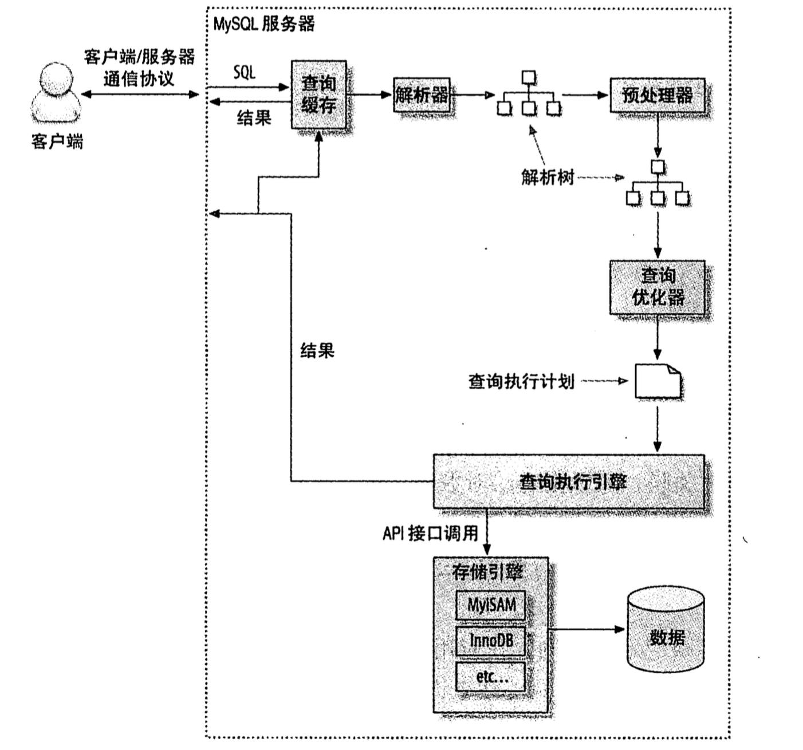

# 查询性能优化

## 为什么查询速度会慢
查询的过程至少包含了以下步骤：
- 客户端发起
- 经过网络到达服务端
- 在服务器上进行解析
- 生成执行计划
- 执行
- 返回结果给客户端

任何一个步骤变慢，都会导致查询慢

## 慢查询基础：优化数据访问

查询性能低下最基本的原因是访问的数据太多。
可以通过如下步骤分析：
- 应用程序是否在检索大量非必要的数据（访问了太多的行或者太多的列）。
- mysql服务器是否在分析大量非必要的数据行。

### 是否向数据库请求了不需要的数据

- 查询了不需要的记录
- 多表关联时返回全部列
- 总是取出全部列
- 重复查询相同的数据

### mysql是否在扫描额外的记录

最简单的衡量查询开销的三个指标：
- 响应时间
- 扫描的行数和返回的行数
- 扫描的行数和访问类型（explain中type列反映了访问类型）

一般sql使用如下三种方式应用where条件，从好到坏依次为：
- 在索引中使用where条件来过滤不匹配的记录。这是在存储引擎层完成的。
- 使用索引覆盖扫描（Extra列中出现了Using index）来返回记录，直接从索引中过滤不需要的记录并返回命中的结果。这是在服务器层完成的，但无须再回表查询记录。
- 从数据表中返回数据，然后过滤不满足条件的记录（在Extra列中出现Using where）。这是在服务器层完成的，需要先从数据表读取记录然后过滤。

如果发现查询需要扫描大量的数据但只返回少量的行，按以下方式优化：
- 使用索引覆盖扫描，把所有需要用的列都放到索引中。
- 改变库表结构。例如使用汇总表。
- 重写这个复杂查询，让mysql优化器能以更优化的方式执行这个查询。

## 分解关联查询

select * from A, B, C where A.id = b.a_id and b.id = c.b_id;

可以分解为

select * from A;

select * from B where b.a_id in (1,2);

select * from C where c.b_id in (3,4,5);

这样分解之后的优点是

- 让缓存的效率更高

- 执行单个查询减少锁竞争

- 更容易对数据库进行拆分，更容易做到高性能和可扩展

- 查询效率本身也可能会有提升

- 减少冗余记录的查询

为了减少关联查询

- 冗余一部分信息，达到单表可查
- 利用ES等搜索引擎的查询能力

## 查询执行的基础

### mysql中如何执行关联查询
mysql对任何关联都执行嵌套循环关联操作，即先在一个表中循环取出单条数据，然后再嵌套循环到下一个表中寻找匹配的行，依次下去，知道找到所有表中匹配的行为止。

### 关联子查询
mysql的子查询实现得非常糟糕。最糟糕的是where条件中包含in的子查询语句。
可以通过explain extend看查询语句被改写成了什么样。
通常建议使用exists等效改写查询来获得更好的效率。

### hint

- straight_join
- use index, ignore index
- sql_small_result, sql_big_result

## 优化特性类型的查询

### 优化count()查询

- count()的作用
- 关于MyISAM的神话(没有任何where条件时才快)
- 简单的优化
- 使用近似值（使用explain返回近似值）
- 更复杂的优化（汇总表或者外部缓存）

### 优化子查询
尽可能使用关联查询代替

### 优化group by和distinct
当无法使用索引时，mysql使用临时表或者文件排序来做分组
当结果集小，给予提示sql_small_result，将结果集放在内存中的索引临时表
当结果集大，给予提示sql_big_result，使用磁盘临时表做排序操作

### 优化limit分页
使用延迟关联查询覆盖索引，可以提高效率。
如果能准确获取上一次查询数据的最后一条，也能大大提高效率。

### 优化union查询
用union all代替union

## 分区表

### 分区表的原理

### 分区表的类型

### 如何使用分区表

### 什么情况下会出问题

### 查询优化

### 合并表

## 服务器设置

### queryCache
#### 过大的缓存（query cache）导致mysql查询效率低
因为看到服务器内存比较大，设置了比较大的query cache

结果从show processlist看到一些进程停留在storing result to query cache
利用set profiling=1，执行那条语句，然后执行show profiles for query 1发现常规来说开销最大的sending data（这个开销不是说输出数据，而是io寻址）只有0.002秒，而storing result to query cache却执行了0.005秒，初看似乎没多少时间，但是考虑到整个sql也就执行了不到0.01秒，这个开销比例蛮大了

将query cache降低了之后发现这条sql速度提升了蛮多，服务器的负载也显著地降低了60%

## explain

explain需要关注的几个列

- type， 分别有all，index，range，ref，eq_reg, const，这几个从差到好，all表示表所有行查询，index表示所有index查询，一般来说，慢sql是index和range居多，如果是index，那说明sql写得太烂了
- rows，数值越小越好，说明多少行数据参与了查询
- extra，很可能从该字段中知道查询优化的方向，可能会出现using filesort，using temporary

建索引的几大原则

1.最左前缀匹配原则，非常重要的原则，mysql会一直向右匹配直到遇到范围查询(>、<、between、like)就停止匹配， 比如a = 1 and b = 2 and c > 3 and d = 4   如果建立(a,b,c,d)顺序的索引，d是用不到索引的，如果建立(a,b,d,c)的索引则都可以用到，a,b,d的顺序可以任意调整。
2.=和in可以乱序，比如a = 1 and b = 2 and c = 3 建立(a,b,c)索引可以任意顺序，mysql的查询优化器会帮你优化成索引可以识别的形式
3. 尽量选择区分度高的列作为索引,区分度的公式是count(distinct col)/count(*)，表示字段不重复的比例，比例越大我们扫描的记录数越少，唯一键的区分度是1，而一些状态、性别字段可能在大数据面前区分度就 是0，那可能有人会问，这个比例有什么经验值吗？使用场景不同，这个值也很难确定，一般需要join的字段我们都要求是0.1以上，即平均1条扫描10条 记录
   4.索引列不能参与计算，保持列“干净”，比如from_unixtime(create_time) = ’2014-05-29’就不能使用到索引，原因很简单，b+树中存的都是数据表中的字段值，但进行检索时，需要把所有元素都应用函数才能比较，显然成本 太大。所以语句应该写成create_time = unix_timestamp(’2014-05-29’);
   5.尽量的扩展索引，不要新建索引。比如表中已经有a的索引，现在要加(a,b)的索引，那么只需要修改原来的索引即可

mysql> show variables like 'profiling%';
+------------------------+-------+
| Variable_name          | Value |
+------------------------+-------+
| profiling              | OFF   |
| profiling_history_size | 15    |
+------------------------+-------+
2 rows in set (0.02 sec)

mysql> SET profiling=1;
Query OK, 0 rows affected, 1 warning (0.00 sec)

mysql> show variables like 'profiling%';
+------------------------+-------+
| Variable_name          | Value |
+------------------------+-------+
| profiling              | ON    |
| profiling_history_size | 15    |
+------------------------+-------+
2 rows in set (0.00 sec)

mysql> show profiles;
+----------+------------+----------------------------------+
| Query_ID | Duration   | Query                            |
+----------+------------+----------------------------------+
|        1 | 0.00833800 | show variables like 'profiling%' |
+----------+------------+----------------------------------+
1 row in set, 1 warning (0.00 sec)

mysql> select count(*) from matchedVideo;
+----------+
| count(*) |
+----------+
|    38336 |
+----------+
1 row in set (0.10 sec)

mysql> select count(*) from takedownNoticeItem;
+----------+
| count(*) |
+----------+
|     2462 |
+----------+
1 row in set (0.01 sec)

mysql> show profiles;
+----------+------------+-----------------------------------------+
| Query_ID | Duration   | Query                                   |
+----------+------------+-----------------------------------------+
|        1 | 0.00833800 | show variables like 'profiling%'        |
|        2 | 0.10125900 | select count(*) from matchedVideo       |
|        3 | 0.01225500 | select count(*) from takedownNoticeItem |
+----------+------------+-----------------------------------------+
3 rows in set, 1 warning (0.00 sec)

mysql> show profile for query 2;
+----------------------+----------+
| Status               | Duration |
+----------------------+----------+
| starting             | 0.000093 |
| checking permissions | 0.000010 |
| Opening tables       | 0.008930 |
| init                 | 0.000027 |
| System lock          | 0.000027 |
| optimizing           | 0.092100 |
| executing            | 0.000019 |
| end                  | 0.000002 |
| query end            | 0.000007 |
| closing tables       | 0.000010 |
| freeing items        | 0.000021 |
| cleaning up          | 0.000013 |
+----------------------+----------+
12 rows in set, 1 warning (0.02 sec)

mysql> show profile for query 3;
+----------------------+----------+
| Status               | Duration |
+----------------------+----------+
| starting             | 0.000060 |
| checking permissions | 0.000008 |
| Opening tables       | 0.000018 |
| init                 | 0.000015 |
| System lock          | 0.000008 |
| optimizing           | 0.012048 |
| executing            | 0.000024 |
| end                  | 0.000005 |
| query end            | 0.000010 |
| closing tables       | 0.000014 |
| freeing items        | 0.000029 |
| cleaning up          | 0.000016 |
+----------------------+----------+
12 rows in set, 1 warning (0.00 sec)
