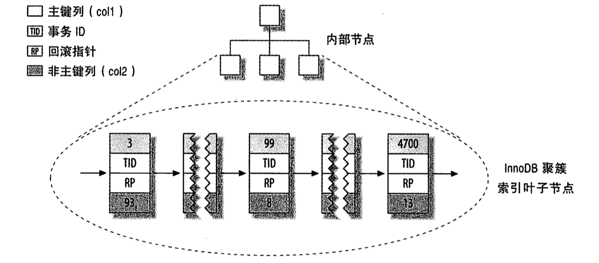
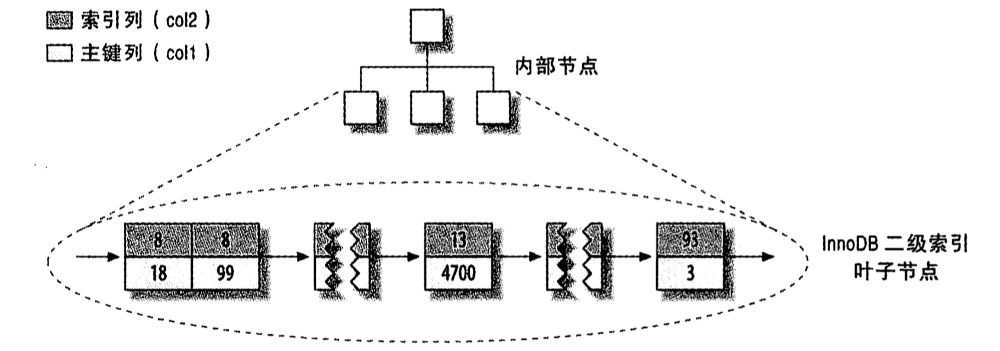
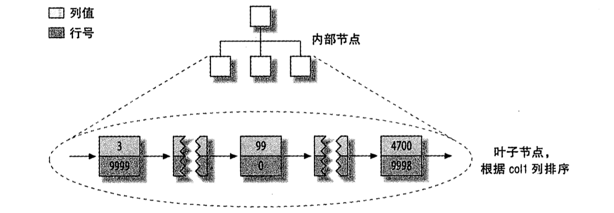
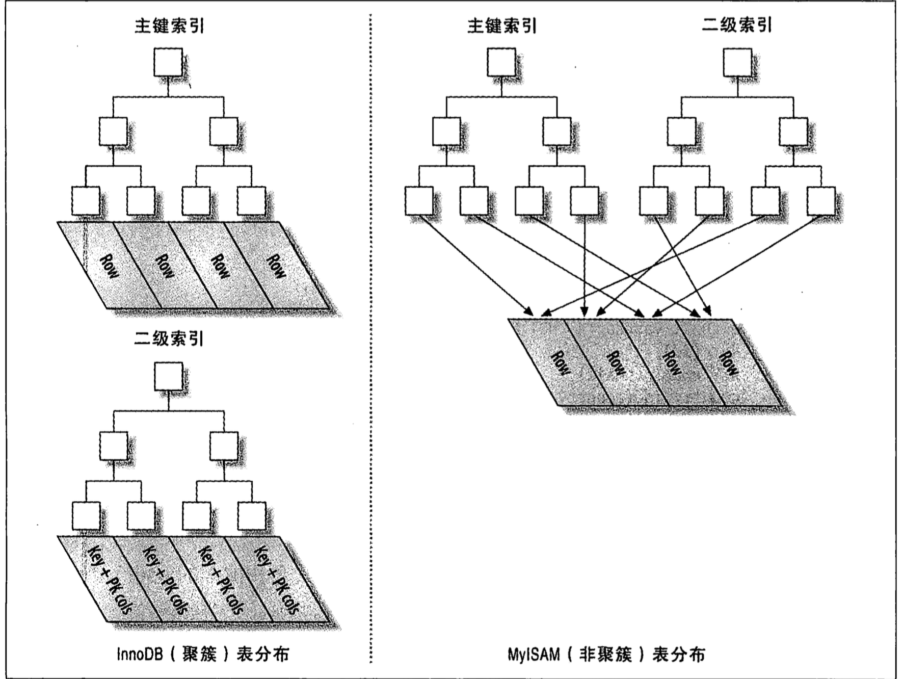

# 创建高性能的索引

索引是存储引擎用于快速找到记录的一种数据结构。
索引优化是查询性能优化最有效的手段。

## 索引基础

要理解索引是如何工作的，最简单的方法就是去看一本书的"索引"部分，也就是目录。如果要找到并学习“索引原理”，那么按照“索引”->"索引原理"来寻找无疑是最快的方式。

查询效率的关键是有序，二分，反过来理解就是，无需遍历所有数据，即可实现快速的定位。

数据索引提供了一种有序。

在有序的情况下，进行检索，二分法效率最高，n条记录中定位查询开销是 log2(N)，（hash索引效率更高，但不提供关系型查询，应用场景比较受局限）。

那么所谓的btree结构也好，或其他的类似结构也好，把握一个原则，接近二分法的查询效率，因为如果做一个完全有序的队列，那么插入，删除，修改需要做的操作开销太大了，大家可以思考一下，所以才会有人设计树形结构，兼顾查询和更新操作。理解这一点对理解整个数据查询效率和索引结构，帮助极大。

### 索引类型

索引有很多数据结构，考虑不同的数据结构需要先理解磁盘IO和内存，cpu之间的速度差距，一次磁盘IO一般在10ms左右，而内存取数据大约是100ns，两者相差了10w倍，所以磁盘IO是非常昂贵的。

考虑到磁盘IO是非常高昂的操作，计算机操作系统做了一些优化，当一次IO时，不光把当前磁盘地址的数据，而是把相邻的数据也都读取到内存缓冲区内，因为局部预读性原理告诉我们，当计算机访问一个地址的数据的时候，与其相邻的数据也会很快被访问到。每一次IO读取的数据我们称之为一页(page)。具体一页有多大数据跟操作系统有关，一般为4k或8k，也就是我们读取一页内的数据时候，实际上才发生了一次IO，这个理论对于索引的数据结构设计非常有帮助。

#### B树索引
B-Tree中每一个叶子到根的距离相同，按顺序存储数据。
利用有序性，从根节点开始进行搜索，槽中存放了指向子节点的指针，通过比较节点页的值和要查找的值找到合适的指针进入下层子节点，最终找到对应的值或者该记录不存在。

#### 哈希索引
基于hash表实现，通过哈希索引查找速度非常快，但也有其限制
- 无法用于排序
- 不支持部分索引列匹配查找
- 只支持等值比较查询
- 出现冲突时，性能下降不可预期
#### 空间数据索引
可以用作地理数据存储
#### 全文索引


## 索引的优点

- 索引大大减少了服务器需要扫描的数据量
- 索引可以帮助服务器避免排序和临时表
- 索引可以将随机IO变为顺序IO

## 索引的副作用

- 额外的维护成本（增删改需要维护索引）
- 额外的空间成本（索引存储的空间也相当可观）
- 额外的时间成本（先查询索引，再查询具体数据）

## 高性能的索引策略

### 独立的列
切勿在索引列上进行计算
例如：select movie_id from movie where movie_id + 4 = 6

### 前缀索引和索引选择性

如果某列的值非常长，如果索引所有的字符串，会让索引大且慢，可以考虑前缀索引，对开始的部分字符进行索引。

但是这么做的前提是要确保足够的索引选择性，也就是确保足够索引的区分度，即不重复的索引值占所有数据比例越高，索引效果越好

alter table city add key(city_name(7));

### 多列索引（复合索引）

一般来说，多列索引的区分度优于单列索引

select * from user where area='$area' order by lastlogin desc limit 30;
索引使用(area，lastlogin)最有效率，比area，lastlogin分别的索引效率会高很多

#### 单列索引优于复合索引的场景
create table movie(
    id int(11) NOT NULL AUTO_INCREMENT,
    actor varchar(64) not null default '',
    movie varchar(64) not null default '',
    author varchar(64) not null default '',
    PRIMARY KEY (id),
      KEY `index_actor` (`actor`)
) ENGINE=InnoDB AUTO_INCREMENT=3 DEFAULT CHARSET=latin1;

Query: select * from movie where actor = ‘will’ order by id

因为二级索引的叶子节点包含了主键值，所以列actor上的索引就相当于(actor,id)上的索引。如果将索引扩展为KEY `index_actor_movie` (actor, movie)
那么实际上就变成了(actor, movie，id)，那么order by子句就无法使用该索引做排序，而只能用文件排序了。

复合索引大部分情况下确实能提高查询性能，但同时对插入和更新的性能有比较大的影响，如果插入的频次和查询的频次是在一个量级，那么就有可能因为复合索引导致插入速度受到比较大影响从而影响了整体数据库的性能，这时候将复合索引改为单列索引，虽然查询变慢了一点，但是插入的收益更大，索引更新的io负载有了明显的降低，整体上来说是提升了性能
所以索引的建立，除了要看查询的语句，插入的语句，更新的语句，也还要关注查询频次和更新频次的数据量

### 选择合适的索引列顺序

正确的顺序依赖于使用该索引的查询，将选择性最高的列放到索引的最前列

### 聚簇索引

当表有聚簇索引时，它的数据航实际上存放在索引的叶子页(leaf page)中。InnoDB通过主键聚集数据，即聚族索引为主键。
当一个表的数据如下时：


其聚簇索引如下：



其col2的二级索引如下：




聚簇索引的优点：
- 可以把相关数据保存在一起。
- 数据访问更快。
- 使用覆盖索引扫描的查询可以直接使用页节点中的主键值。

聚簇索引的缺点：
- 插入速度严重依赖插入顺序


推荐使用自增，如果用UUID会很糟糕，聚簇索引的插入变得随机，导致很多额外的工作。

- 更新聚族索引列的代价很高，会强制InnoDB将每个被更新的行移动到新的位置。
- 插入新行或者更新主键时，可能导致"页分裂"。
- 二级索引（非聚族索引）可能比想象的要更大，因为二级索引的叶子节点包含了引用行的主键列。
- 二级索引访问需要两次索引查找，而非一次。二级索引中保存的是行的主键值，得到之后还需要去聚族索引中找到对应的行。


#### InnoDB和MyISAM的数据分布对比
MyISAM按照数据插入的顺序存储在磁盘上
MyISAM中主键索引和其他索引在结构上没什么不同，主键索引就是一个名为PRIMARY的唯一非空索引。



InnoDB中，聚簇索引"就是"表，每一个叶子节点都包含了主键值，事务ID，用于事务的MVCC的回滚指针以及所有的剩余列
二级索引的叶子节点中存储的不是"行指针"，而是主键值，并以此作为指向行的"指针"，这样设计
优点：移动行时无需更新二级索引中的这个"指针"
缺点：会让二级索引占用更多的空间



### 覆盖索引

使用索引来直接获取列的数据。

优点：

- 索引条目通常远小于数据行大小，能极大减少数据访问量。
- 因为索引是按照列值顺序存储，所以比随机从磁盘读取每一行数据的IO要少得多。
- 如果使用的引擎是InnoDB，覆盖索引查询可以避免对主键索引的二次查询。

在Explain的Extra列中看到Using index的信息，说明使用了覆盖索引

#### 延迟关联

前置条件：movie表有索引(actor,title)

select * from movie where actor = 'will smith' and title like '%black man%';

利用延迟关联原理改成

select * from movie a, (select id from movie where actor = 'will smith' and title like '%black man%') b where a.id = b.id;

在子查询中利用覆盖索引找到匹配的id，然后再与外层关联查询

第一个数据集 will smith出演了30000部电影, 电影名中包含black man的有2000部，性能基本一致，因为查询返回了一个很大的结果集，因此看不到优化的效果。大部分时间都花在读取和发送数据上了
第二个数据集 will smith出演了30000部电影, 电影名中包含black man的有20部，经过索引过滤，子查询只返回了很少的结果集，优化效果明显，优化后只需要读取20行完整数据行，而不是原查询中需要的30000条
第三个数据集 will smith出演了30部电影, 电影名中包含black man的有20部，子查询效率反而下降。因为索引过滤时符合第一个条件的结果集已经很少，所以子查询带来的成本反而比从表中直接提取完整行更高

### 使用索引扫描来做排序

mysql有两种方式可以生成有序结果

- 通过排序操作
- 按索引顺序扫描


只有当索引的列顺序和order by子句的顺序完全一致，且所有列的排序方向（倒序或正序）都一样时，mysql才能使用索引来对结果做排序。

如果查询需要关联多张表，则只有当order by子句引用的字段全部为第一个表时，才能使用索引做排序。

### 压缩（前缀压缩）索引

MyISAM使用前缀压缩来减少索引的大小，从而让更多的索引可以放入内存中，这在某些情况下能极大地提高性能

### 冗余索引

大多数情况下都不需要冗余索引，应该尽量扩展已有的索引而非创建新索引。

但也有时候出于性能方面的考虑需要冗余索引

```
create table movie(
    id int(11) NOT NULL AUTO_INCREMENT,
    actor varchar(64) not null default '',
    movie varchar(64) not null default '',
    author varchar(64) not null default '',
    PRIMARY KEY (id),
    KEY `index_actor` (`actor`)
) ENGINE=InnoDB AUTO_INCREMENT=3 DEFAULT CHARSET=latin1;
```
Q1:
select count(*) from movie where actor = 'will smith';

Q2:
select movie, author from movie where actor = 'will smith';

Q1查询QPS大概是115，而Q2的QPS是10.

为了提高Q2的QPS，将原来的索引改为
KEY `index_actor_movie_author` (actor, movie, author)

更改之后Q2的QPS提升了，但是Q1的QPS反而下降了

如果想要两个查询都更快，那么就需要冗余索引，创建两个索引
KEY `index_actor` (`actor`)
KEY `index_actor_movie_author` (actor, movie, author)

但是这样会带来插入速度变慢的后果，索引越多，插入越慢

## 索引案例学习

### 巧用in来优化sql，使用索引提升查询速度
```create table star(
    id int(11) NOT NULL AUTO_INCREMENT,
    name varchar(64) not null default '',
    sex enum(‘man’,’woman') not null default ‘man',
    age tinyint not null default 0,
    PRIMARY KEY (id)
) ENGINE=InnoDB AUTO_INCREMENT=3 DEFAULT CHARSET=latin1;
```
在以下query中如何加索引，以下sql速度都能在0.5s内查出结果，数据集在百万
Q1:
select * from star where age > 21;

Q2:
select * from star where name like ’smith%’;

Q3:
select * from star where age > 21 and age < 30 and sex = ‘man';

Q4:
select * from star where age > 21 and age < 30 and name like ’smith%’ and sex = ‘man';

首先，Q3，Q4的查询语句中的age条件可以修改为age in (22, 23, 24, 25, 26, 27, 28, 29)
然后增加索引（sex, age, name）和(name)两个索引
最后将Q1，Q2的查询语句增加sex in(‘man’,’woman')

### 优化排序
```
create table star(
    id int(11) NOT NULL AUTO_INCREMENT,
    name varchar(64) not null default '',
    sex enum(‘man’,’woman') not null default ‘man',
    age tinyint not null default 0,
    PRIMARY KEY (id)
) ENGINE=InnoDB AUTO_INCREMENT=3 DEFAULT CHARSET=latin1;
```
Q1：
select * from star where sex = ‘man’ order by age limit 20;

增加索引(sex,age)可以提高Q1速度
但是
Q2：
select * from star where sex = ‘man’ order by age limit 100000，20;
仍然很慢，因为mysql需要花费大量时间去扫描需要舍弃的数据，纯从sql上可以用延迟关联来提高性能

select a.* from start a, (select id from star where sex = ‘man’ order by age limit 100000，20) b where a.id = b.id;

在技术上可以用反范式，预先计算，缓存等方式来解决
在业务上可以限制用户翻页数量来解决，实际上很少会有用户需要翻到第n页来查数据

## 维护索引和表

### 更新索引统计信息

analyze table 进行一次全索引扫描

### 减少索引和数据的碎片

通过执行optimize table或者导出再导入的方式重新整理数据

## 总结

创建索引和使用索引的过程中，注意如下原则

- 单行访问时很慢的。
- 按顺序访问范围数据是很快的。
- 索引覆盖查询时很快的。